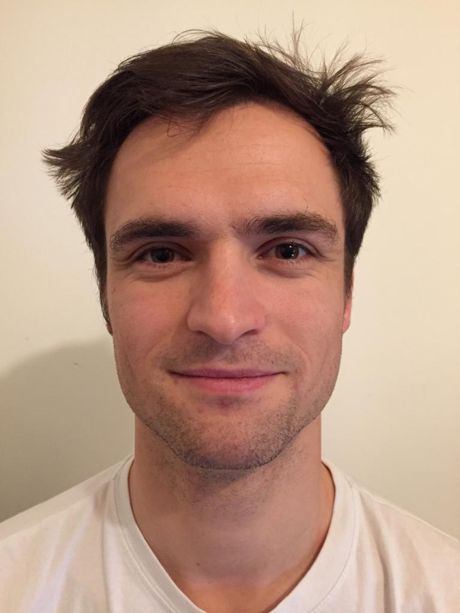

# Guillaume Bellec

[Code resources](#code-resources) - [Publications](#main-publications) - [Teaching](#teaching)

Postdoc at the Laboratory of Computational Neuroscience  
Ecole Polytechnique Fédérale de Lausanne (EPFL)  
guillaume @ bellec . eu   
[CV](https://github.com/guillaumeBellec/guillaumeBellec.github.io/blob/master/CV_of_Guillaume_Bellec__english_(4).pdf)

  I develop theories to advance our understanding of brains and intelligent machines. I studied artificial intelligence during my Master in Paris and I completed my PhD with Wolfgang Maass in the Institute for Theoretical Computer Science of TU Graz in Austria. I am now a postdoc with Wulfram Gerstner in the Laboratory of Computational Neuroscience at EPFL in Switzerland.

# Code resources

- [E-prop](https://github.com/IGITUGraz/eligibility_propagation) in Tensorflow. Code used in the [Nature Communications 2020 paper](https://www.nature.com/articles/s41467-020-17236-y) _A solution to the learning dilemma for recurrent networks of spiking neurons_.

- [LSNN](https://github.com/IGITUGraz/LSNN-official) in Tensorflow.  Code used in the [NIPS 2018 paper](http://papers.nips.cc/paper/7359-long-short-term-memory-and-learning-to-learn-in-networks-of-spiking-neurons) _Long short-term memory and Learning-to-learn in spiking neural networks_.

- [Deep Rewiring](https://github.com/guillaumeBellec/deep_rewiring) in Tensorflow.  Code used in the [ICLR 2018 paper](https://arxiv.org/abs/1711.05136) _Deep Rewiring: Training very sparse deep networks_.

# Main publications
For a complete list of publications, visit my [google scholar profile](https://scholar.google.fr/citations?user=fSXUVvAAAAAJ).

- A solution to the learning dilemma for recurrent networks of spiking neurons  
G Bellec\*, F Scherr\*, A Subramoney, E Hajek, D Salaj, R Legenstein, W Maass  
[Nature Communications](https://www.nature.com/articles/s41467-020-17236-y)

- Eligibility traces provide a data-inspired alternative to backpropagation through time  
G Bellec\*, F Scherr\*, E Hajek, D Salaj, A Subramoney, R Legenstein, W Maass  
[NeurIPS 2019 (workshop)](https://openreview.net/forum?id=SkxJ4QKIIS)

- Biologically inspired alternatives to backpropagation through time for
  learning in recurrent neural nets  
G Bellec\*, F Scherr\*, E Hajek, D Salaj, R Legenstein, W Maass  
[arxiv 2019](https://arxiv.org/abs/1901.09049)

- Long short-term memory and Learning-to-learn in networks of spiking neurons  
G Bellec\*, D Salaj\*, A Subramoney\*, R Legenstein, W Maass  
[NIPS 2018](https://arxiv.org/abs/1803.09574)

- Memory-Efficient Deep Learning on a SpiNNaker 2 Prototype  
C Liu\*, G Bellec\* ...  R Legenstein and C Mayr  
[Frontiers in Neuroscience | Neuromorphic Engineering 2018](https://www.frontiersin.org/articles/10.3389/fnins.2018.00840/full)

- Deep Rewiring: Training very sparse deep networks  
G Bellec, D Kappel, W Maass, R Legenstein  
[ICLR 2018](https://arxiv.org/abs/1711.05136)

- Neuromorphic hardware in the loop: Training a deep spiking network on the brainscales wafer-scale system  
S Schmitt, J Klähn, G Bellec ... R Legenstein, W Maass, J Schemmel, K Meier  
(IJCNN 2017) International Joint Conference on Neural Networks

- Slow feature analysis with spiking neurons and its application to audio stimuli  
G Bellec, M Galtier, R Brette, P Yger  
(JCNS 2016) Journal of computational neuroscience

- Creating audio based experiments as social web games with the casimir framework  
D Wolff, G Bellec, A Friberg, A MacFarlane, T Weyde  
(AES 2014) Audio Engineering Society Conference

- A social network integrated game experiment to relate tapping to speed perception and explore rhythm reproduction  
G Bellec, A Elowsson, A Friberg, D Wolff, T Weyde  
(SMS 2013) Sound and Music Computing Conference

(*: equal contributions and team work)

# Teaching

- Machine Learning at TU Graz in 2019  (practicals at master level)  
[Registration page](https://online.tugraz.at/tug_online/wbLv.wbShowLVDetail?pStpSpNr=216646)

- Introduction to machine learning at TU Graz from 2016 to 2019  
(aka computational intelligence, lectures and practicals at bachelor level)  
[Registration page](https://online.tugraz.at/tug_online/wbLv.wbShowLVDetail?pStpSpNr=203426&pSpracheNr=2)

- Reinforcement learning at TU Graz in 2017  
(aka autonously learning systems, practicals at master level) 
