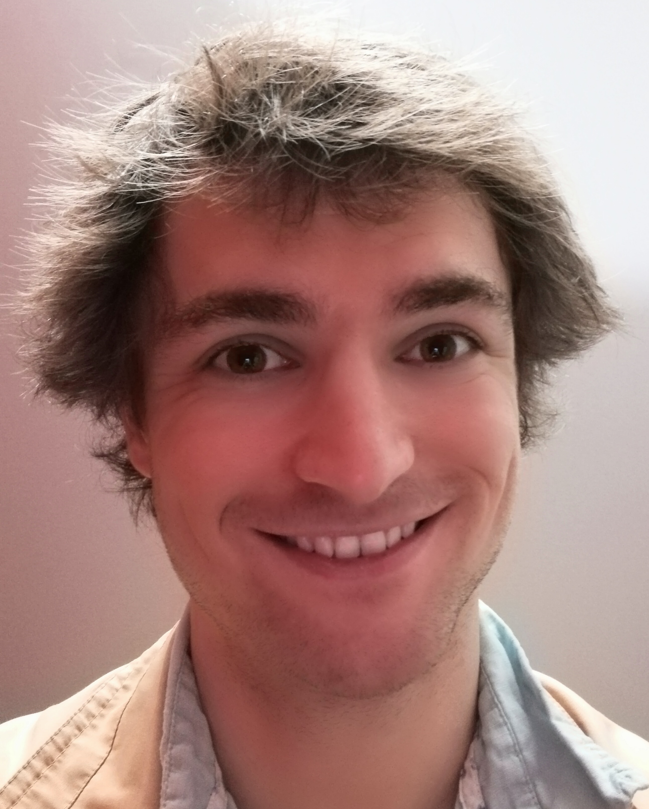

# Guillaume Bellec
PhD student at the [institute for theoretical computer science](https://www.tugraz.at/institute/igi/home/) (IGI).  
Technical University of Graz in Austria  
last_name@igi.tugraz.at  
[CV](https://github.com/guillaumeBellec/guillaumeBellec.github.io/blob/master/CV_of_Guillaume_Bellec__english_%20(1).pdf)

  I am a PhD student of in the Institute for Theoretical Computer Science in the Technical University of Graz in Austria. Under the supervision of Professor Wolfgang Maass, I investigate models of learning and working memory. I am grateful to learn every day through readings and collaborative research projects. On the long term, I hope that my research will contribute to the clinical progress and the development of a machine intelligence that respects human morals. 

  Before starting my PhD, I graduated from a competitve master of Machine Learning at ENS Paris-Saclay and from the engineering school ENSTA Paristech. There I completed various lab rotations, one of which was initiated by my passion for music and got me to discover Psychoacoustics and Neuroscience. Ever since, I question myself about the neural mechanisms behind thoughts and perceptions.

# Teaching

- Computational Intelligence (Lectures and exercices at bachelor level)  
[Course material](https://www.spsc.tugraz.at/courses/computational-intelligence)  
[Registration page](https://online.tugraz.at/tug_online/wbLv.wbShowLVDetail?pStpSpNr=203426&pSpracheNr=2)

- Autonomously learning systems (Exercies at master level)  
[Course Material](https://courses-igi.tugraz.at/courses/6)

# Code resources
- [Deep Rewiring](https://github.com/guillaumeBellec/deep_rewiring)

# Main publications
For a complete list of publications please find my [google scholar profile](https://scholar.google.fr/citations?user=fSXUVvAAAAAJ&hl=fr).

- Long short-term memory and Learning-to-learn in networks of spiking neurons  
Guillaume Bellec\*, Darjan Salaj\*, Anand Subramoney\*, Robert Legenstein, Wolfgang Maass  
[(NIPS 2018)](https://arxiv.org/abs/1803.09574)

- Memory-Efficient Deep Learning on a SpiNNaker 2 Prototype
Chen Liu*, Guillaume Bellec*, ...  Robert Legenstein and Christian G. Mayr
[Frontiers in Neuroscience | Neuromorphic Engineering](https://www.frontiersin.org/articles/10.3389/fnins.2018.00840/full)

- Deep Rewiring: Training very sparse deep networks  
G Bellec, D Kappel, W Maass, R Legenstein  
[(ICLR 2018)](https://arxiv.org/abs/1711.05136)

- Neuromorphic hardware in the loop: Training a deep spiking network on the brainscales wafer-scale system  
S Schmitt, J Klähn, G Bellec, A Grübl, M Guettler, A Hartel, S Hartmann, ...  
(IJCNN 2017) International Joint Conference on Neural Networks

- Slow feature analysis with spiking neurons and its application to audio stimuli  
G Bellec, M Galtier, R Brette, P Yger  
(JCNS 2016) Journal of computational neuroscience

- Creating audio based experiments as social web games with the casimir framework  
D Wolff, G Bellec, A Friberg, A MacFarlane, T Weyde  
(AES 2014) Audio Engineering Society Conference

- A social network integrated game experiment to relate tapping to speed perception and explore rhythm reproduction  
G Bellec, A Elowsson, A Friberg, D Wolff, T Weyde  
(SMS 2013) Sound and Music Computing Conference

(*: equal contributions and team work)

# Art works
For music and related art works visit my [youtube channel](http://www.youtube.com/user/Adrienavets).
