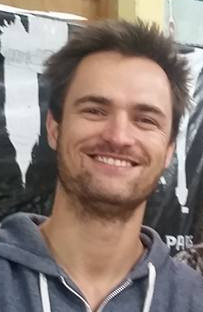

# Guillaume Bellec

[Code resources](#code-resources) - [Publications](#main-publications) - [Teaching](#teaching) - [Art works](#art-works)

Postdoc at the Laboratory of Computational Neuroscience  
Ecole Polytechnique Fédérale de Lausanne (EPFL)  
guillaume @ bellec . eu   
[CV](https://github.com/guillaumeBellec/guillaumeBellec.github.io/blob/master/CV_of_Guillaume_Bellec__english_.pdf.pdf)

  I am now a postdoc with Wulfram Gerstner in the Laboratory of Computational Neuroscience of EPFL. Before that I completed my PhD with Wolfgang Maass in the Institute of Theoretical Computer Science at the Technical University of Graz in Austria. There, I developped learning theories for network models that are inspired by recent discoveries in neuroscience. We have shown that our models can be as efficient as deep learning algorithms, eventhough it models explicitly the biophysical mechanisms used by the brain to learn and compute. I hope that my work will help to understand better the mysteries of biology.

  During my studies, I acquired strong technical competences in applied mathematics and machine learning and I also wanted to apply that to a concrete project with a direct impact. Hence, I co-founded and developed [ChordAI](http://chordai.net/) with Viven Seguy, an app that can recognize guitar chords in real-time using deep learning techonlogy. I hope that it will help many music fans like me to play there instruments.  

 <iframe width="280" height="500" style="text-align: center;" src="https://www.youtube.com/embed/B7O4t7mweVw"></iframe>

# Code resources
- [Deep Rewiring](https://github.com/guillaumeBellec/deep_rewiring) in Tensorflow.  Code used in the [ICLR 2018 paper](https://arxiv.org/abs/1711.05136) _Deep Rewiring: Training very sparse deep networks_.

# Main publications
For a complete list of publications, visit my [google scholar profile](https://scholar.google.fr/citations?user=fSXUVvAAAAAJ&hl=fr).

- A solution to the learning dilemma for recurrent networks of spiking neurons  
G Bellec\*, F Scherr\*, A Subramoney, E Hajek, D Salaj, R Legenstein, W Maass  
[BioRxiv 2019 (under review)](https://www.biorxiv.org/content/10.1101/738385v3)

- Eligibility traces provide a data-inspired alternative to backpropagation through time  
G Bellec\*, F Scherr\*, E Hajek, D Salaj, A Subramoney, R Legenstein, W Maass  
[NeurIPS 2019 (workshop)](https://openreview.net/forum?id=SkxJ4QKIIS)

- Slow processes of neurons enable a biologically plausible approximation to policy gradient  
A Subramoney\*, G Bellec\*, F Scherr\*, E Hajek, D Salaj, R Legenstein, W Maass  
[NeurIPS 2019 (workshop)](https://sites.google.com/view/biologicalandartificialrl#h.p_rtzf9pTMv6QI)

- Biologically inspired alternatives to backpropagation through time for
  learning in recurrent neural nets  
G Bellec\*, F Scherr\*, E Hajek, D Salaj, R Legenstein, W Maass  
[arxiv](https://arxiv.org/abs/1901.09049)

- Long short-term memory and Learning-to-learn in networks of spiking neurons  
G Bellec\*, D Salaj\*, A Subramoney\*, R Legenstein, W Maass  
[NIPS 2018](https://arxiv.org/abs/1803.09574)

- Memory-Efficient Deep Learning on a SpiNNaker 2 Prototype  
C Liu\*, G Bellec\* ...  R Legenstein and C Mayr  
[Frontiers in Neuroscience | Neuromorphic Engineering 2018](https://www.frontiersin.org/articles/10.3389/fnins.2018.00840/full)

- Deep Rewiring: Training very sparse deep networks  
G Bellec, D Kappel, W Maass, R Legenstein  
[ICLR 2018](https://arxiv.org/abs/1711.05136)

- Neuromorphic hardware in the loop: Training a deep spiking network on the brainscales wafer-scale system  
S Schmitt, J Klähn, G Bellec ... R Legenstein, W Maass, J Schemmel, K Meier  
(IJCNN 2017) International Joint Conference on Neural Networks

- Slow feature analysis with spiking neurons and its application to audio stimuli  
G Bellec, M Galtier, R Brette, P Yger  
(JCNS 2016) Journal of computational neuroscience

- Creating audio based experiments as social web games with the casimir framework  
D Wolff, G Bellec, A Friberg, A MacFarlane, T Weyde  
(AES 2014) Audio Engineering Society Conference

- A social network integrated game experiment to relate tapping to speed perception and explore rhythm reproduction  
G Bellec, A Elowsson, A Friberg, D Wolff, T Weyde  
(SMS 2013) Sound and Music Computing Conference

(*: equal contributions and team work)

# Teaching

- Machine Learning  (Practicals at master level)  
[Registration page](https://online.tugraz.at/tug_online/wbLv.wbShowLVDetail?pStpSpNr=216646)

- Computational Intelligence (Lectures and practicals at bachelor level)  
[Registration page](https://online.tugraz.at/tug_online/wbLv.wbShowLVDetail?pStpSpNr=203426&pSpracheNr=2)

- Autonomously learning systems (Practicals at master level) 

# Art works
For music and related art works visit my [youtube channel](http://www.youtube.com/user/Adrienavets).
