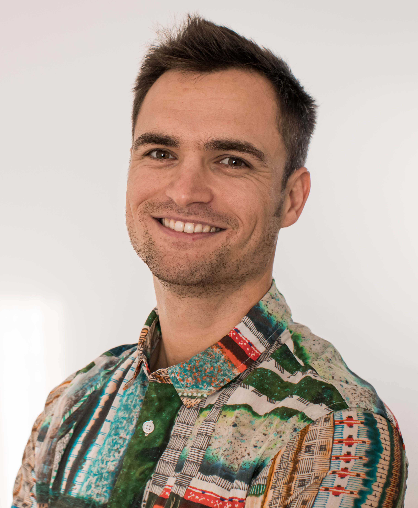
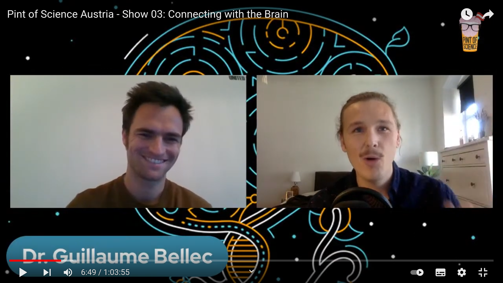
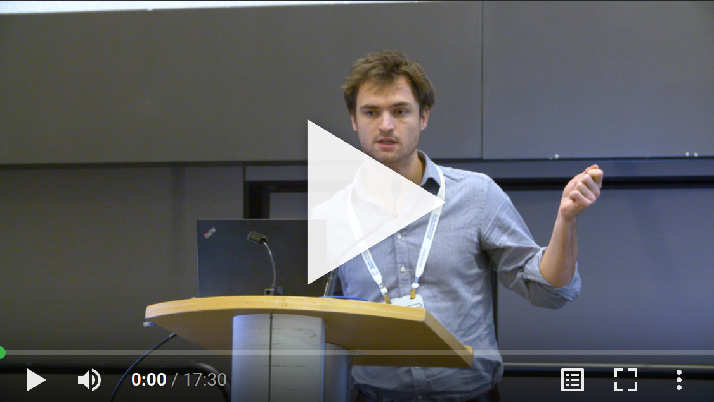

# Guillaume Bellec

[Code resources](#code-resources) - [Publications](#selected-publications) - [Teaching](#teaching)

Postdoc at the Laboratory of Computational Neuroscience  
Ecole Polytechnique Fédérale de Lausanne (EPFL)  
guillaume . bellec @ epfl . ch  
[CV](https://github.com/guillaumeBellec/guillaumeBellec.github.io/blob/master/CV_of_Guillaume_Bellec__english_(2).pdf)

  I develop computational theories of brains and intelligent machines. I studied machine learning during my Master in Paris and I completed my PhD in the Institute for Theoretical Computer Science of TU Graz in Austria. Currently, I am a postdoc in the Laboratory of Computational Neuroscience at EPFL in Switzerland. My work is most well-known for showing that a competitive artificial intelligence can emerge from simple mathematical models of biologically realistic neural networks. Multiple of my publications are published in selective computer science conferences like NeurIPS or ICLR and more generalist journals like Nature Communications.
  
  In 2019 I created [Chord ai](https://chordai.net) with another AI researcher Vivien Seguy. Chord ai is a mobile application using deep learning and artificial neural networks to recognize musical chords in real-time. The application and Chord ai has had more than 2,000,000 users on iOS and Android platforms in 2023. The technical achievement has been to bring state-of-the-art artificial intelligence technology to any popular power-limited mobile device. Besides the scientific challenge, I hope that it will help amateur musicians like me to improve their musical skills. 
  
<!---
Online talks

Pints of science 2021   popular-science about the brain | NeurIPS workshop 2019   contributed talk
-|-
 | 
--->

# Open-source codes

- [multitask mini-toolbox](https://github.com/guillaumeBellec/multitask) in PyTorch: optimize multiple loss functions without fine-tuning task weights.

### Data-constrained simulations of biological neural networks 

- [Trial matching](https://github.com/EPFL-LCN/pub-sourmpis2023-neurips/tree/master) in PyTorch: biological network model of electrophysiology data with optimal transport [neurips 2023](https://openreview.net/forum?id=LAbxkhkjbD).  

- [Sample-and-measure](https://github.com/EPFL-LCN/pub-bellec-wang-2021-sample-and-measure) in TensorFlow 2: fitting neural data with a differentiable spiking simulator  [neurips 2021](https://proceedings.neurips.cc/paper/2021/hash/9a32ff36c65e8ba30915a21b7bd76506-Abstract.html).

### Models of brain plasticity and neuromorphic computing

- [Self-supervised model](https://github.com/EPFL-LCN/pub-illing2021-neurips) in PyTorch: local (layer-wise) self-supervised learning  [CLAPP, neurips 2021](https://proceedings.neurips.cc/paper/2021/hash/feade1d2047977cd0cefdafc40175a99-Abstract.html).

- [E-prop](https://github.com/IGITUGraz/eligibility_propagation) in Tensorflow: a local alternative to back-prop through time [Nature Communications 2020 paper](https://www.nature.com/articles/s41467-020-17236-y).

- [LSNN](https://github.com/IGITUGraz/LSNN-official) in Tensorflow: Long short-term memory and meta-learning in spiking neural networks [neurips 2018](http://papers.nips.cc/paper/7359-long-short-term-memory-and-learning-to-learn-in-networks-of-spiking-neurons).

- [Deep Rewiring](https://github.com/guillaumeBellec/deep_rewiring) in Tensorflow: training sparse deep networks from scratch [ICLR 2018](https://arxiv.org/abs/1711.05136)

# Selected publications
For a complete list of publications, visit my [google scholar profile](https://scholar.google.fr/citations?user=fSXUVvAAAAAJ).

- Trial matching: capturing variability with data-constrained spiking neural networks
C Sourmpis, CCH Petersen, W Gerstner, G Bellec
[NeurIPS 2023](https://openreview.net/forum?id=LAbxkhkjbD) - [Code](https://github.com/EPFL-LCN/pub-sourmpis2023-neurips/tree/master) - [Arxiv](https://arxiv.org/abs/2306.03603)

- Fitting summary statistics of neural data with a differentiable spiking network simulator  
G Bellec\*, S Wang\*, A Modirshanechi, J Brea, W Gerstner   
[NeurIPS 2021](https://arxiv.org/abs/2106.10064) - [Code](https://github.com/EPFL-LCN/pub-bellec-wang-2021-sample-and-measure)

- Local plasticity rules can learn deep representations using self-supervised contrastive predictions  
B Illing, J Ventura, G Bellec\*, W Gerstner\*   
[NeurIPS 2021](https://arxiv.org/abs/2010.08262) - [Code](https://github.com/EPFL-LCN/pub-illing2021-neurips)

- A solution to the learning dilemma for recurrent networks of spiking neurons  
G Bellec\*, F Scherr\*, A Subramoney, E Hajek, D Salaj, R Legenstein, W Maass  
[Nature Communications](https://www.nature.com/articles/s41467-020-17236-y) - [Code](https://github.com/IGITUGraz/eligibility_propagation)

- Biologically inspired alternatives to backpropagation through time for
  learning in recurrent neural nets  
(three chapters on eligibility propagation, the first became the Nature Communications paper)   
G Bellec\*, F Scherr\*, E Hajek, D Salaj, R Legenstein, W Maass  
[Arxiv 2019](https://arxiv.org/abs/1901.09049)

- Long short-term memory and Learning-to-learn in networks of spiking neurons  
G Bellec\*, D Salaj\*, A Subramoney\*, R Legenstein, W Maass  
[NIPS 2018](https://papers.nips.cc/paper/7359-long-short-term-memory-and-learning-to-learn-in-networks-of-spiking-neurons.pdf) - [Code](https://github.com/IGITUGraz/LSNN-official) - [Arxiv](https://arxiv.org/abs/1803.09574) 

- Memory-Efficient Deep Learning on a SpiNNaker 2 Prototype  
C Liu\*, G Bellec\* ...  R Legenstein and C Mayr  
[Frontiers in Neuroscience 2018](https://www.frontiersin.org/articles/10.3389/fnins.2018.00840/full)

- Deep Rewiring: Training very sparse deep networks  
G Bellec, D Kappel, W Maass, R Legenstein  
[ICLR 2018](https://arxiv.org/abs/1711.05136) - [Code](https://github.com/guillaumeBellec/deep_rewiring)

- Neuromorphic hardware in the loop: Training a deep spiking network on the brainscales wafer-scale system  
S Schmitt, J Klähn, G Bellec ... R Legenstein, W Maass, J Schemmel, K Meier  
(IJCNN 2017) International Joint Conference on Neural Networks

- Slow feature analysis with spiking neurons and its application to audio stimuli  
G Bellec, M Galtier, R Brette, P Yger  
(JCNS 2016) Journal of computational neuroscience

- Creating audio based experiments as social web games with the casimir framework  
D Wolff, G Bellec, A Friberg, A MacFarlane, T Weyde  
(AES 2014) Audio Engineering Society Conference

- A social network integrated game experiment to relate tapping to speed perception and explore rhythm reproduction  
G Bellec, A Elowsson, A Friberg, D Wolff, T Weyde  
(SMS 2013) Sound and Music Computing Conference

(*: comparable contributions and team work)

# Teaching

- Machine Learning at TU Graz in 2019  (practicals at master level)  
[Registration page](https://online.tugraz.at/tug_online/wbLv.wbShowLVDetail?pStpSpNr=216646)

- Introduction to machine learning at TU Graz from 2016 to 2019  
(aka computational intelligence, lectures and practicals at bachelor level)  
[Registration page](https://online.tugraz.at/tug_online/wbLv.wbShowLVDetail?pStpSpNr=203426&pSpracheNr=2)

- Reinforcement learning at TU Graz in 2017  
(aka autonously learning systems, practicals at master level) 
